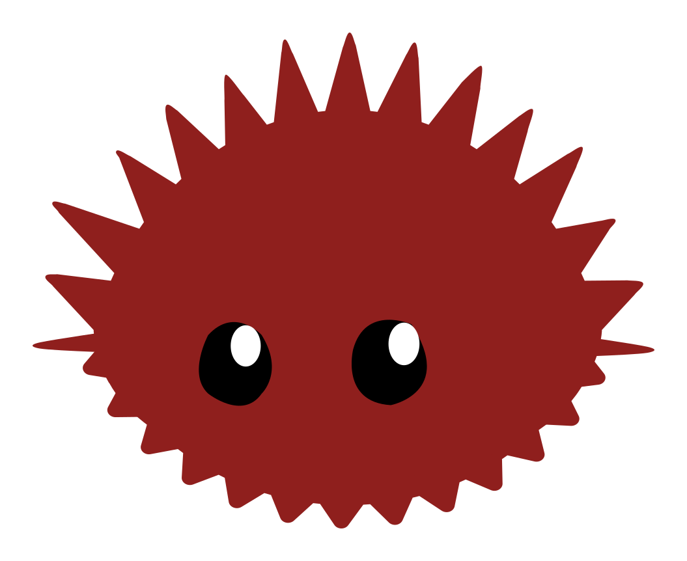
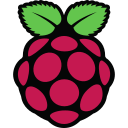
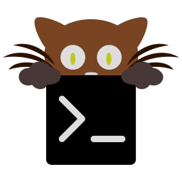
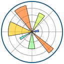
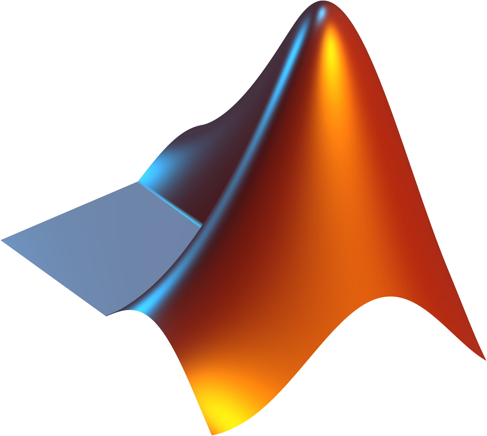

# Howdy, I'm Jazz! 👋
*Everything would be better with Vim keybindings*

<h2>Stats</h2>

  

## About Me

- 🔭 I’m completing my masters at Dartmouth College in Computer Engineering!
- 🌱 I’m currently learning to implement Rust in low level computing

## 📫 How to Reach Me 

- [📧 Email](mailto:jasmeet.bhatia.us@gmail.com?subject=Hello%20Jazz&body=Hi%20Jazz,%0A%0A)
- [💼 LinkedIn](https://www.linkedin.com/in/jasmeet-jazz-bhatia-446a141b2/)
- [🐘 Mastodon](https://mastodon.social/@HiFiveJazz)

## Languages and Tools

### Operating System and Environment

  
  
  

### Low Level Languages

  
  
  
  

### Virtualization/Containerization

  
  
  

### Embedded Programming

  
  
  
  

### Terminal

  
  
  
  
  
  

### Web Development

  
  
  
  
  
  
  
  

### Databases

  

### Academic Research

  
  
  
  
  
  
  
  

### Creative Design

  
  

